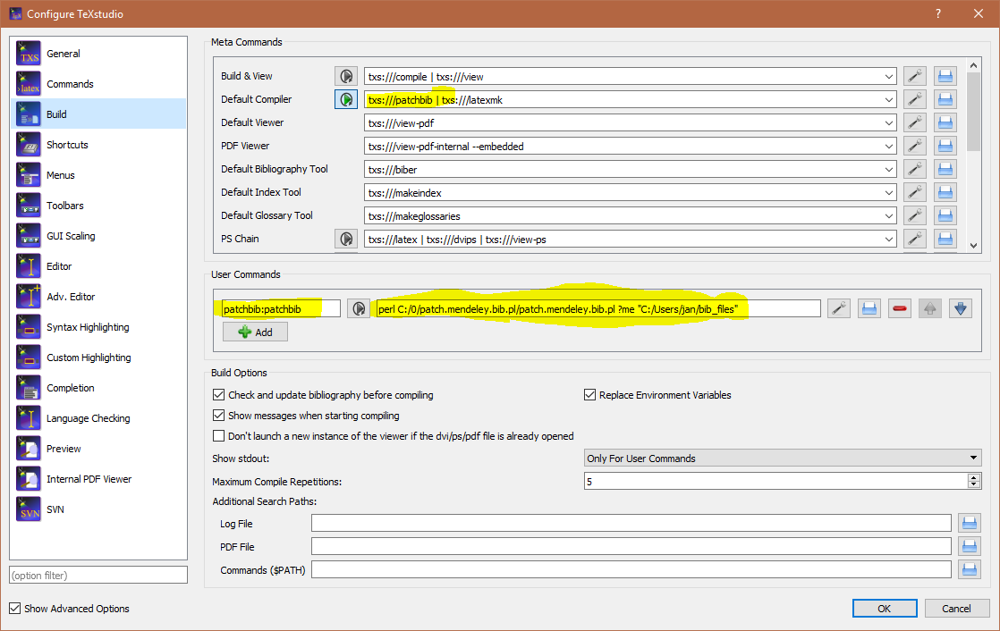

# patch.mendeley.bib.pl
A small to Pearl script that fetches the current .bib file from Mendeley and patches it for use with biblatex/biber.

Its main purpose is to remove the double `{{` brackets from the title fields and thus allow case adjustments of biblatex (`\DeclareFieldFormat{titlecase}{\MakeSentenceCase*{#1}}`) to work. It also adds suport for `in press` articles. Just use a year between 3000 and 3999 as year field in Mendeley (specifies order for multiple same author in-press publications).
## Usage
###TLDR:
Just save-link-as the [pearl script](patch.mendeley.bib.pl?raw=True) somewhere and run it with:
    
    pearl patch.mendeley.bib.pl YOURLATEXFILE.tex Y:/OUR/MENDELEY/.bib/EXPORT/FOLDER
    

###In your LaTeX preamble:
    
    \usepackage[backend=biber]{biblatex}
    \addbibresource{<folder name in your Mendeley library containing the citations used>.bib}
###In Mendeley:

###In your latex editor:

Just save the pearl script somewhere and run. 
You still need to press Mendeley's Sync button to update the original `.bib` file.
